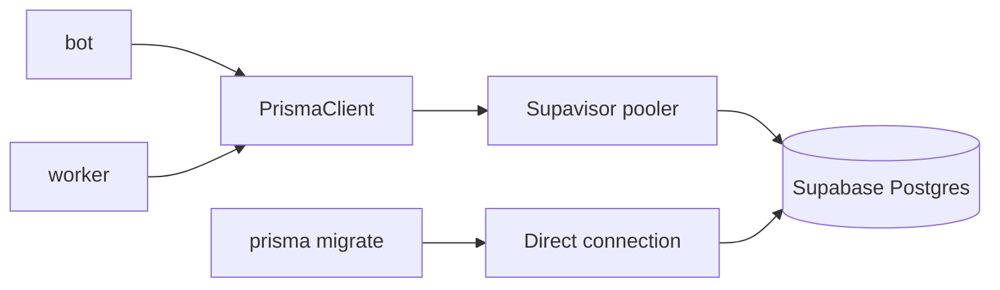

# PRD: Dread Community Discord Bot

**Spec Kit epic**: `001-dread-community-bot` (split into specs `002`–`010` — see [EPIC.md](./EPIC.md), [SPEC-INDEX.md](../SPEC-INDEX.md))  
**Active implementation**: start with `002-core-platform` / branch `002-core-platform`  
**Specification**: [spec.md](./spec.md)

## Problem Statement

The dread-repo community relies on Discord for mod updates, repository activity, support, and moderation. Today there is no unified bot that:

- Announces Thunderstore core and official plugin releases with changelogs in one place per server
- Surfaces GitHub activity on `dread-repo/dreadREPO` with readable formatting
- Helps staff publish clear announcements before they go public
- Automates support forum triage in the official server
- Provides consistent moderation and self-serve download/feature information

Community members miss updates, staff repeat the same support answers, and announcements vary in quality. Multi-server communities need per-guild configuration without giving global moderators unchecked power in every server.

## Solution

Build a production Discord bot that:

- Serves many guilds with per-guild configuration stored in **Supabase Postgres**, accessed via **Prisma ORM** from bot and worker only
- Uses Discord Container (Components v2) for all public-facing messages
- Runs heavy work (watchers, LLM, repo scans) through a Redis-backed job queue with separate bot and worker Docker services
- Watches Thunderstore (core + official plugins + globally registered packages) and GitHub (`dread-repo/dreadREPO`) with deduplicated announcements
- Offers LLM-assisted staff announcements (ephemeral preview, soft quality gate, explicit confirm)
- Automates the official support forum (FAQ, duplicate review, conditional codebase help)
- Provides guild-scoped moderation and utility commands from bundled JSON content

## User Stories

1. As a server administrator, I want to register a Thunderstore announcement channel and ping role, so that my community is notified when core or official plugins update.
2. As a server administrator, I want to register a GitHub announcement channel and choose which event types to receive, so that my community sees only relevant repository activity in one channel.
3. As a server administrator without config permission, I want denied setup attempts with a clear ephemeral error, so that I know to contact staff.
4. As a community member, I want Thunderstore updates in one channel with version, timestamp, core/plugin label, and dread branding, so that I can track the mod ecosystem without checking Thunderstore manually.
5. As a community member, I want full changelogs when they fit and LLM-labeled summaries when they are too long, so that I understand what changed without losing access to full details via links.
6. As a community member, I want GitHub and Thunderstore buttons on announcements, so that I can open releases in one click.
7. As a community member, I want no duplicate announcements for the same version or webhook delivery, so that channels stay readable.
8. As a community member, I want GitHub updates for pushes, PRs, CI, releases, issues, and deployments when my server enabled them, so that I stay aligned with development activity.
9. As a community member, I want GitHub announcements without role pings, so that I am not spammed with notifications for routine repo activity.
10. As a staff member with config permission, I want to draft announcements with ephemeral LLM feedback and a Container preview, so that I can improve messaging before it goes public.
11. As a staff member, I want to post anyway when the LLM warns about style, so that I remain in control of urgent communications.
12. As a staff member, I want to confirm before publishing to a selected channel, so that announcements are never sent accidentally.
13. As a support seeker in the official Dread server, I want FAQ guidance on new forum posts, so that common questions are answered immediately.
14. As support staff, I want duplicate detection with a link to the original thread and review buttons, so that I can close duplicates deliberately rather than automatically.
15. As a support seeker, I want optional codebase-informed replies when the system is not overloaded, so that I get accurate answers tied to the right repository.
16. As a support seeker, I want instructions to specify a repository when auto-detection fails, so that I can still get help.
17. As support staff, I want prior codebase attempts stored for the thread, so that follow-up answers stay consistent.
18. As a guild moderator, I want purge, ban, kick, timeout, role management, and userinfo commands, so that I can manage the server from Discord.
19. As a guild owner, I want to delegate bot-admin via set-admin (Discord Administrator only), so that trusted staff can configure the bot without sharing my Discord admin role.
20. As a global admin from the official Dread server, I want to configure other guilds but not moderate them without local rights, so that community safety is preserved across servers.
21. As an official-guild administrator, I want to register new global Thunderstore packages, so that all servers receive announcements for newly official plugins.
22. As an administrator outside the official guild, I want global plugin registration denied, so that the canonical package list stays controlled.
23. As a community member in allowlisted channels, I want occasional in-character Dread replies when discussing the mod, so that the server has personality without spam.
24. As a support seeker, I want no in-character replies in forum or announcement channels, so that serious channels stay professional.
25. As any member, I want /features, /readme, and /download commands, so that I can learn about the bot and find install links without asking staff.
26. As a developer maintaining the bot, I want utility and FAQ content in JSON bundles, so that copy updates do not require code changes for every text tweak.
27. As a platform operator, I want bot and worker containers with Redis queuing, so that interactions stay fast while watchers and LLM work run reliably in the background.

## Implementation Decisions

### Architecture

- **Two-process model**: Bot handles Discord gateway and interactions (ack within 3s, enqueue work). Worker consumes Redis (BullMQ) jobs and performs watchers, LLM calls, forum pipeline, repo scans, and channel posts via Discord REST.
- **Docker Compose on VPS**: Services `bot`, `worker`, `redis` (self-hosted). Optional reverse proxy for GitHub webhooks TLS.
- **Supabase Postgres + Prisma ORM 7**: Durable guild config, global packages, watcher dedupe state, forum attempts, optional announcement draft sessions. Bot and worker use a shared `PrismaClient` (`@prisma/adapter-pg`) over Postgres connection strings — not `@supabase/supabase-js` in v1. Schema and migrations are owned by **Prisma Migrate** (`prisma/schema.prisma`, `prisma/migrations/`); Supabase hosts the database only (dashboard, backups, optional future RLS). See [data-model.md](./data-model.md) and persistence section below.
- **Hardcoded constants**: Official guild `1510452344024727775`; GitHub repo `dread-repo/dreadREPO`.
- **Bundled JSON**: Official Thunderstore manifest, FAQ, repo-tag map, features/readme/downloads content.

### Deep modules (testable interfaces)

| Module | Responsibility | Interface sketch |
|--------|----------------|------------------|
| **PermissionResolver** | Centralize Discord Administrator, bot-admin, global admin (config vs mod vs official-only commands) | `can(user, guild, action): Result` |
| **ContainerMessageBuilder** | Build Components v2 payloads: watcher, announcement, utility, forum, moderation cards | `build(template, data): MessagePayload` |
| **GuildConfigStore** | CRUD per-guild Thunderstore/GitHub/forum/admin settings via Prisma | `getThunderstore(guildId)`, `setGitHubEvents(...)`, etc. |
| **GlobalPackageRegistry** | Manifest load + `global_packages` rows (Prisma) + GitHub release URL mapping | `listWatchedPackages(): Package[]`, `registerGlobal(pkg)` |
| **WatcherDedupeStore** | Idempotent announce decisions (`watcher_dedupe` via Prisma) | `shouldAnnounce(key): boolean`, `markAnnounced(key)` |
| **ThunderstoreWatcher** | Poll/check versions, enqueue announce jobs | `checkAll(): void` |
| **GitHubWebhookHandler** | Validate signature, map event type, enqueue announce jobs | `handle(payload): void` |
| **AnnounceJobProcessor** | Fetch changelog/body, optional LLM summarize, build Container, post to guild channels | `process(job): void` |
| **LlmGateway** | Prompts, token limits, budget gate, provider adapter | `summarize(text)`, `reviewAnnouncement(draft)`, `classifyRepo(text)`, `dreadReply(ctx)`, `forumAnswer(ctx)` |
| **AnnouncementSession** | Ephemeral draft lifecycle: preview, edit, confirm, post anyway | `start`, `preview`, `confirm(channelId)` |
| **ForumPipeline** | FAQ → duplicate → conditional codebase; staff button handlers | `onNewPost(thread)`, `onDuplicateAction(interaction)` |
| **RepoRouter** | Tag map → LLM classifier → fallback command hint | `resolve(thread): Repo \| Fallback` |
| **RepoScanner** | Shallow clone or GitHub tree read for support answers | `scan(repo, query): ScanResult` |
| **ForumAttemptStore** | Persist attempts for thread context (`forum_attempts` via Prisma) | `save(attempt)`, `history(threadId)` |
| **DreadReplyGate** | Allowlist, 1% probability, keyword match, channel blocklist | `shouldReply(message): boolean` |
| **ModerationCommands** | Thin wrappers over Discord API with permission checks | standard slash handlers |
| **UtilityContent** | Load and render JSON bundles | `getFeatures()`, `getReadme()`, `getDownloads()` |
| **JobQueue** | BullMQ queue names, enqueue helpers, concurrency limits | `enqueue(queue, data)` |

### Permission model (final)

- **Config** (watcher setup, forum register in official guild): Discord Administrator OR bot-admin in guild OR global admin (official guild bot-admin).
- **Global plugin register**: Official guild only; admin there.
- **Moderation**: bot-admin OR Discord Administrator **in that guild only** (global admin has no mod abroad).
- **Set-admin**: Discord Administrator in guild only.

### Message contract (watchers + published announcements)

- Container v2 with: dread branding, version/ref, timestamp, core\|plugin or GitHub event type.
- Body: full text if under limit; else LLM summary with explicit label pointing to Thunderstore/GitHub.
- Buttons: GitHub + Thunderstore (Thunderstore omitted on non-release GitHub events).

### Persistence (Prisma on Supabase Postgres)

**Decision**: Supabase-hosted Postgres; **Prisma ORM 7** as the only schema/migration and query layer. Full column definitions: [data-model.md](./data-model.md).

| Concern | Approach |
|---------|----------|
| **Schema source of truth** | `prisma/schema.prisma` + `prisma/migrations/` (not `supabase/migrations/`) |
| **Runtime access** | Shared `PrismaClient` in `src/lib/db/prisma.ts` (bot + worker) |
| **Migrations (dev)** | `pnpm db:migrate:dev` → `prisma migrate dev` (uses `DIRECT_URL`) |
| **Migrations (deploy)** | `pnpm db:migrate:deploy` before bot/worker start in Docker/CI |
| **Env** | `DATABASE_URL` (transaction pooler, `?pgbouncer=true`) for runtime; `DIRECT_URL` (direct host) for CLI/migrate |
| **Supabase JS / REST** | Out of scope v1 unless Auth, Storage, or Realtime are added later |
| **RLS** | Optional v2; v1 relies on server-side-only DB credentials (no anon client) |

**Tables** (snake_case in DB, Prisma models aligned 1:1):

- `guild_config`, `guild_thunderstore_config`, `guild_github_config`, `guild_forum_config`, `guild_bot_admins`
- `global_packages`, `watcher_dedupe`, `forum_attempts`, `announcement_drafts`

**Application rules** (not in Prisma): official-guild-only forum config; GitHub events JSON validation; dedupe via insert-with-conflict semantics (`skipDuplicates` or equivalent).

### Job queues

- `watcher:thunderstore`, `watcher:github`, `llm:announcement-review`, `llm:changelog-summarize`, `forum:post-pipeline`, `index:repo-scan`, `llm:dread-reply`

### Phased delivery

- P0: Docker, bot/worker/redis, Prisma schema + initial migration + `PrismaClient` factory, interaction framework, Container builder, PermissionResolver, JobQueue
- P1: Config commands, moderation, utility JSON commands
- P2: Thunderstore watcher + global plugin register
- P3: GitHub webhook + event toggles
- P4: Announcement session + LLM soft gate
- P5: Forum pipeline
- P6: Dread in-character replies

### Technology choices

- discord.js (latest) with Components v2 / Container messages strictly for public output
- BullMQ + self-hosted Redis
- **Prisma ORM 7** (`prisma`, `@prisma/client`, `@prisma/adapter-pg`, `pg`) on **Supabase Postgres** — indexes on `guild_id`, unique dedupe keys, short transactions; lowercase snake_case table names; dev against Supabase cloud project recommended
- LLM provider via env-configured adapter

**Database env (required for bot/worker and migrate):**

| Variable | Purpose |
|----------|---------|
| `DATABASE_URL` | Runtime: Supabase transaction pooler (port 6543) + `?pgbouncer=true` |
| `DIRECT_URL` | Prisma CLI / `migrate deploy`: direct `db.<project-ref>.supabase.co:5432` |

Do not use pooled URL for migrations (PgBouncer breaks `prisma migrate`). Do not commit connection strings.

## Testing Decisions

### What makes a good test

- Assert **observable behavior** at module boundaries: permission decisions, dedupe keys, message payload structure, job enqueue side effects.
- Avoid testing Discord.js internals or LLM provider SDK details; mock external IO at module edges.
- Prefer contract/snapshot tests for `ContainerMessageBuilder` output shapes.

### Modules to test (recommended)

| Module | Priority | Approach |
|--------|----------|----------|
| PermissionResolver | P0 | Table-driven matrix: global admin abroad, bot-admin, Discord admin |
| ContainerMessageBuilder | P0 | Snapshots for watcher, announcement, utility templates |
| WatcherDedupeStore | P1 | Unit: first announce yes, repeat no (mock Prisma or test DB) |
| GlobalPackageRegistry | P1 | Manifest merge with global registrations |
| RepoRouter | P2 | Tag hit, classifier mock, fallback path |
| AnnounceJobProcessor | P2 | Mock LlmGateway + builder; oversized changelog triggers summary flag |
| AnnouncementSession | P2 | State machine: preview → confirm → post; post anyway path |
| ForumPipeline | P3 | Mock stores; load gate skips codebase step |
| GitHubWebhookHandler | P3 | Fixture payloads per event type |
| UtilityContent | P1 | JSON fixtures match rendered sections |

### Integration tests

- BullMQ job handlers with mocked Discord REST, GitHub, Thunderstore HTTP.
- Store integration tests: separate test database URL (Supabase branch/project or local Postgres) or mock at `GuildConfigStore` / `WatcherDedupeStore` boundaries — never production.
- No live Discord in CI; manual verify runbook for Tier 1 later.

### Prior art

- Greenfield repo: establish Vitest (or project-standard runner) in BOOT phase.

## Out of Scope

- Voice agents
- Discord sharding until scale requires it
- Per-guild custom GitHub org/repos
- Re-processing edited forum posts (v1: initial post only)
- Global plugin registration outside official guild
- Non-English localization

## Further Notes

- Specification: [spec.md](./spec.md)
- Data model: [data-model.md](./data-model.md)
- Persistence ADR (when added): `docs/adr/0002-prisma-on-supabase-postgres.md`
- Next steps: align [plan.md](./plan.md), [research.md](./research.md) R3, and [tasks.md](./tasks.md) with this PRD; implement on branch `001-dread-community-bot`
- Implementation skills: discord-bot-architect, supabase-postgres-best-practices (schema/query tuning on hosted Postgres); Prisma via project Prisma skills / Context7 docs
