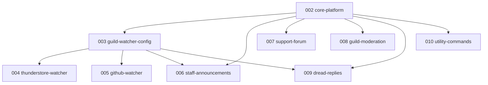

# Spec Kit feature index

## Epic

| ID | Folder | Role |
|----|--------|------|
| 001 | [001-dread-community-bot](./001-dread-community-bot/EPIC.md) | Epic index + umbrella PRD |

## Implementation order

| # | Feature | Priority | Spec |
|---|---------|----------|------|
| 002 | Core platform | P0 | [spec](./002-core-platform/spec.md) |
| 003 | Guild watcher config | P1 | [spec](./003-guild-watcher-config/spec.md) |
| 004 | Thunderstore watcher | P1 | [spec](./004-thunderstore-watcher/spec.md) |
| 005 | GitHub watcher | P1 | [spec](./005-github-watcher/spec.md) |
| 006 | Staff announcements | P2 | [spec](./006-staff-announcements/spec.md) |
| 007 | Support forum | P2 | [spec](./007-support-forum/spec.md) |
| 008 | Guild moderation | P2 | [spec](./008-guild-moderation/spec.md) |
| 009 | Dread in-character replies | P3 | [spec](./009-dread-replies/spec.md) |
| 010 | Utility commands | P3 | [spec](./010-utility-commands/spec.md) |

Active pointer: [.specify/feature.json](../.specify/feature.json)
